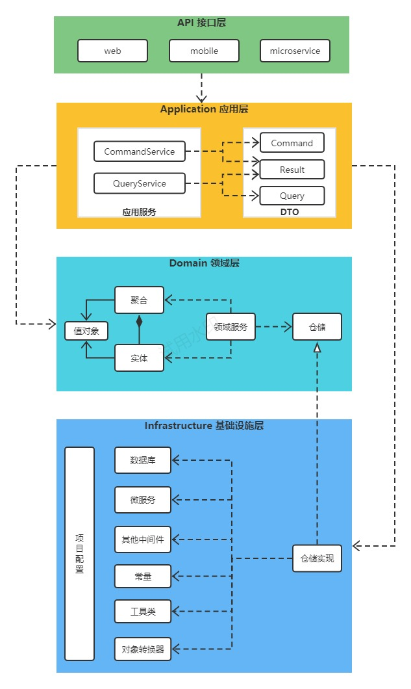

# DDD-BOOT
DDD (Domain-Driven Design) 领域驱动设计工程化落地框架

* [快速开始](#快速开始)
* [架构说明](#架构说明)
* [通用组件](#通用组件)
* [示例讲解](#示例讲解)

## 快速开始

### 创建项目
```shell
mvn archetype:generate \
 -DgroupId=org.example \
 -DartifactId=ddd-example \
 -Dversion=1.0.0-SNAPSHOT \
 -Dpackage=org.example.ddd \
 -DarchetypeGroupId=io.github.chensheng \ 
 -DarchetypeArtifactId=ddd-microservice-archetype \ 
 -DarchetypeVersion=1.0.0-SNAPSHOT
```

### 运行项目
```shell
mvn spring-boot:run
```

## 架构说明

### 概述


框架采用4层架构，分别为接口层、应用层、领域层、基础设施层。

### 分层说明

#### 接口层
对外提供REST接口，按调用方的不同进行分包。

#### 应用层
负责业务逻辑的编排，不负责具体的业务逻辑。

`应用服务`
对应到一个具体的业务场景，通过编排实体、聚合、仓储、领域服务来完成。
按照CQRS(命令查询职责分离)模式将应用服务分为CommandService和QueryService。
CommandService完成会改变系统状态的业务场景（写操作），只能依赖于领域层。
QueryService完成查询数据的业务场景（读操作），可穿透领域层，直接调用基础设施层的数据库查询方法。

`DTO`
分为Command、Query、Result三类。Command和Query为应用服务的入参，Result为应用服务的返回结果。
Command为CommandService的入参。Query为QueryService的入参。

#### 领域层
核心层，完全独立，不依赖其他层。该层沉淀了整个业务域中的业务领域模型，核心的业务逻辑都在这层。

`实体`
业务对象，具有业务属性和业务行为。

`值对象`
相关属性的集合，对实体的状态、特征进行业务语义的描述。

`聚合`
由业务逻辑紧密关联的实体组成的。

`领域服务`
当业务逻辑不属于任何实体和聚合时，可将其放在领域服务中。设计领域服务的一个原则是：如无必要，勿写领域服务。

`仓储`
对资源访问的抽象，包括数据库、文件、微服务、外部系统等资源。领域层只定义仓储的接口，具体实现在基础设施层完成。

#### 基础设施层
负责与其他微服务、外部系统、数据库及Redis等其他中间件的交互。

`项目配置`
项目工程与技术相关的配置，比如拦截器、MyBatis、Redis等配置。

`仓储实现`
根据领域层定义的仓储接口，实现仓储的具体功能。

`对象转换器`
使用[MapStruct](https://mapstruct.org)完成各层对象的转换，包括DTO、实体、聚合、值对象、PO等对象。
```java
@Mapper(componentModel = MappingConstants.ComponentModel.SPRING)
public interface ExampleConvertor {
    Example toExamplePo(ExampleEntity entity);
}
```

### 架构校验
通过测试用例校验代码是否符合DDD规范，防止开发者写代码时冲破架构。
```java
public class DDDArchitectureTest {
    @Test
    public void testDDDArchitecture() {
        ArchitectureTest.validateDDD("org.example");
    }
}
```

## 通用组件
[通用组件介绍](/ddd-boot/README.md)


## 示例讲解
[示例代码](/ddd-archetypes/ddd-microservice)

针对简单的增删改查业务，通过继承、实现通用的`Entity` `DataObject` `Result` `Repository` `Convertor` `Mapper`，避免编写重复的代码。

### 创建领域模型
实现`DDDEntity`，补充领域属性、领域行为。
```java
@Getter
@Builder
public class ExampleEntity implements DDDEntity {
    /*============= 领域属性 start ================*/
    private Long id;

    private String username;

    private String password;

    private ExampleStatus status;
    /*============= 领域属性 end ================*/

    
    /*============= 领域行为 start ================*/
    /**
     * 新建用户
     * @param username 用户名；必传
     * @param password 密码；必传
     * @return
     */
    public static ExampleEntity create(String username, String password) {
        if(TextUtil.isBlank(username)) {
            throw new BizException("用户名不能为空");
        }
        if(TextUtil.isCNWord(username)) {
            throw new BizException("用户名不能包含中文");
        }
        if(TextUtil.isBlank(password)) {
            throw new BizException("密码不能为空");
        }
        if(password.length() < 6) {
            throw new BizException("密码不能少于6位数");
        }

        ExampleEntity user = builder()
                .username(username)
                .password(password)
                .status(ExampleStatus.ENABLE)
                .build();
        user.checkPasswordFormat();
        return user;
    }

    /**
     * 修改密码
     * @param oldPassword 原密码；必传
     * @param newPassword 新密码；必传
     */
    public void updatePassword(String oldPassword, String newPassword) {
        if(TextUtil.isBlank(oldPassword)) {
            throw new BizException("原密码不能为空");
        }
        if(TextUtil.isBlank(newPassword)) {
            throw new BizException("新密码不能为空");
        }
        if(newPassword.length() < 6) {
            throw new BizException("密码不能少于6位数");
        }
        if(!this.password.equals(oldPassword)) {
            throw new BizException("原密码错误");
        }
        if(oldPassword.equals(newPassword)) {
            throw new BizException("新密码不能与旧密码相同");
        }

        this.password = newPassword;
        this.checkPasswordFormat();
    }

    /**
     * 启用用户
     */
    public void enable() {
        if(this.status == ExampleStatus.ENABLE) {
            throw new BizException("用户已是启用状态");
        }

        this.status = ExampleStatus.ENABLE;
    }

    /**
     * 停用用户
     */
    public void disable() {
        if(this.status == ExampleStatus.DISABLE) {
            throw new BizException("用户已是禁用状态");
        }

        this.status = ExampleStatus.DISABLE;
    }
    /*============= 领域行为 end ================*/

    private void checkPasswordFormat() {
        String passwordFormat = "^(?![A-Za-z0-9]+$)(?![a-z0-9\\W]+$)(?![A-Za-z\\W]+$)(?![A-Z0-9\\W]+$)[a-zA-Z0-9\\W]{8,}$";
        if(TextUtil.isBlank(password) || !password.matches(passwordFormat)) {
            throw new BizException("密码必须由数字、字母、特殊字符_#@!组成，且不能少于8位！");
        }
    }
}
```

### 创建Result对象
API的返回结果
```java
@Data
public class ExampleResult {
    private Long id;

    private String username;
}
```

### 创建数据对象及Mapper
继承`DataObject`, 或实现`IDataObject`
```java
@Data
public class Example extends DataObject {
    private String username;

    private String password;

    private ExampleStatus status;
}
```

继承`BaseMapper`
```java
public interface ExampleMapper extends BaseMapper<Example> {
}
```

### 创建仓储
继承`DDDRepository`
```java
public interface ExampleRepository extends DDDRepository<ExampleEntity> {
}
```

继承`DDDRepositoryImpl`
```java
@Component
public class ExampleRepositoryImpl extends DDDRepositoryImpl<ExampleEntity, Example, ExampleConvertor, ExampleMapper> implements ExampleRepository {
}
```

### 查询功能

#### QueryService
继承`DDDQueryService`
```java
public interface ExampleQueryService extends DDDQueryService<ExampleResult> {
}
```

继承`DDDQueryServiceImpl`
```java
@Service
public class ExampleQueryServiceImpl extends DDDQueryServiceImpl<ExampleEntity, Example, ExampleResult, ExampleConvertor, ExampleMapper> implements ExampleQueryService {
}
```

#### Query
创建分页查询Query， 继承`PageQuery`
```java
@Data
public class ExamplePageQuery extends PageQuery {
    @QuerySortable
    private String username;

    @QueryCondition(column = "username", operator = ConditionOperator.like)
    private String usernameLike;

    @QuerySortable(order = OrderType.DESC)
    private ExampleStatus status;

    @Override
    protected Long getMaxSize() {
        return 20l;
    }
}
```

创建列表查询Query，继承`ListQuery`
```java
@Data
public class ExampleListQuery extends ListQuery {
    @QuerySortable
    private String username;

    @QueryCondition(column = "username", operator = ConditionOperator.like)
    private String usernameLike;

    @QuerySortable(order = OrderType.DESC)
    private ExampleStatus status;

    @Override
    protected Long getMaxLimit() {
        return 10l;
    }
}
```

#### API
```java
@RestController
@RequestMapping("/web/example")
public class ExampleController {
    @Autowired
    private ExampleQueryService exampleQueryService;

    @GetMapping("/page")
    public Page<ExampleResult> page(@Valid ExamplePageQuery query) {
        return exampleQueryService.page(query);
    }

    @GetMapping("/list")
    public List<ExampleResult> list(@Valid ExampleListQuery query) {
        return exampleQueryService.list(query);
    }

    @GetMapping("/{id}")
    public ExampleResult detail(@PathVariable Long id) {
        return exampleQueryService.detail(id);
    }
}
```

### 增删改功能

#### Command
```java
@Data
public class ExampleCreateCommand {
    @NotEmpty(message = "请输入用户名")
    private String username;

    @NotEmpty(message = "请输入密码")
    private String password;
}
```

```java
@Data
public class ExampleUpdatePasswordCommand {
    @NotEmpty(message = "请输入旧密码")
    private String oldPassword;

    @NotEmpty(message = "请输入新密码")
    private String newPassword;
}
```

#### CommandService
```java
public interface ExampleCommandService {
    void create(ExampleCreateCommand command);

    void update(ExampleUpdatePasswordCommand command);

    void enable(Long id);

    void disable(Long id);

    void delete(Long id);
}
```

```java
@Service
@Transactional
public class ExampleCommandServiceImpl implements ExampleCommandService {
    @Autowired
    private ExampleRepository exampleRepository;

    @Override
    public void create(ExampleCreateCommand command) {
        ExampleEntity entity = ExampleEntity.create(command.getUsername(), command.getPassword());
        exampleRepository.save(entity);
    }

    @Override
    public void update(ExampleUpdatePasswordCommand command) {
        Long userId = securityRepository.getLoginUser();
        ExampleEntity entity = exampleRepository.getById(userId);
        entity.updatePassword(command.getOldPassword(), command.getNewPassword());
        exampleRepository.save(entity);
    }

    @Override
    public void enable(Long id) {
        ExampleEntity entity = exampleRepository.getById(id);
        entity.enable();
        exampleRepository.save(entity);
    }

    @Override
    public void disable(Long id) {
        ExampleEntity entity = exampleRepository.getById(id);
        entity.disable();
        exampleRepository.save(entity);
    }

    @Override
    public void delete(Long id) {
        ExampleEntity entity = exampleRepository.getById(id);
        exampleRepository.remove(entity);
    }
}
```

#### API
```java
@RestController
@RequestMapping("/web/example")
public class ExampleController {
    @Autowired
    private ExampleCommandService exampleCommandService;
    
    @PostMapping
    public void create(@Valid @RequestBody ExampleCreateCommand command) {
        exampleCommandService.create(command);
    }

    @PutMapping("/password")
    public void updatePassword(@Valid @RequestBody ExampleUpdatePasswordCommand command) {
        exampleCommandService.update(command);
    }

    @PutMapping("/{id}/enabled")
    public void enable(@PathVariable Long id) {
        exampleCommandService.enable(id);
    }

    @PutMapping("/{id}/disabled")
    public void disable(@PathVariable Long id) {
        exampleCommandService.disable(id);
    }

    @DeleteMapping("/{id}")
    public void delete(@PathVariable Long id) {
        exampleCommandService.delete(id);
    }
}
```


